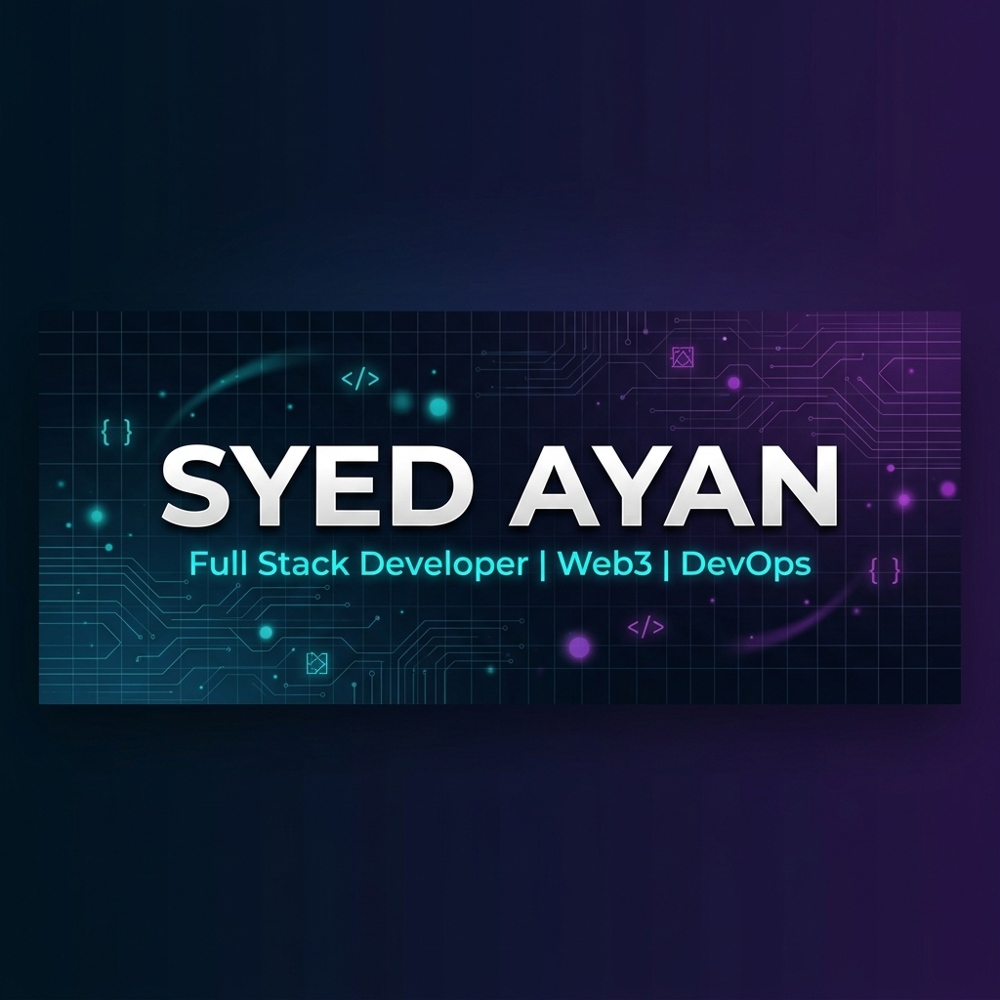

<div align="center">

<!-- HEADER BANNER -->


<!-- TYPING ANIMATION -->
<br/>

[](https://git.io/typing-svg)

<br/>

<!-- PROFILE BADGES -->
<p>
  <a href="https://github.com/SyedAynan?tab=followers">
    
  </a>
  <a href="https://github.com/SyedAynan?tab=repositories&sort=stargazers">
    
  </a>
  
</p>

</div>

<!-- ABOUT ME -->
##  &nbsp;About Me


```yaml
name: Syed Ayan
located_in: India
current_focus: Full Stack & Web3 Development

fields_of_interest:
  - Full Stack Development
  - Blockchain & Web3
  - Cloud & DevOps
  - System Architecture
  
currently_building:
  - Decentralized Applications
  - Scalable Web Platforms
  - Smart Contract Systems

education:
  - Computer Science & Engineering

motto: "Every line of code tells a story."
```

<br/>

- 🔭 Currently building **Smart Parking Management Systems** & **DeFi Protocols**
- 🌱 Diving deep into **Rust, Solidity & Kubernetes**
- 💬 Ask me about **React, Node.js, Python, Web3, DevOps**
- ⚡ Fun fact: I break things first, then fix them better
- 🎯 Goal: Contributing to Open Source & building impactful products

<br clear="both"/>

---

<!-- TECH STACK -->
## 🛠️ Tech Stack & Tools

<div align="center">

### 💻 Languages
<p>
  
  
  
  
  
  
  
  
</p>

### 🧩 Frameworks & Libraries
<p>
  
  
  
  
  
  
  
  
</p>

### ⛓️ Blockchain & Web3
<p>
  
  
  
  
  
</p>

### ☁️ DevOps & Cloud
<p>
  
  
  
  
  
  
  
  
</p>

### 🗄️ Databases & Tools
<p>
  
  
  
  
  
  
</p>

</div>

---

<!-- GITHUB STATS -->
## 📊 GitHub Stats

<div align="center">
   
  
</div>

<div align="center">
  
</div>

---

<!-- ACTIVITY GRAPH -->
## 📈 Contribution Graph

<div align="center">
  
</div>

---

<!-- FEATURED PROJECTS -->
## 🚀 Featured Projects

<div align="center">
  <a href="https://github.com/SyedAynan/Smart-Parking-Management-System">
    
  </a>
  <a href="https://github.com/SyedAynan/Nexus-Bank">
    
  </a>
</div>

<br/>

<div align="center">
  <a href="https://github.com/SyedAynan/Neural-Feedback">
    
  </a>
</div>

---

<!-- SNAKE ANIMATION -->
## 🐍 Contribution Snake

<div align="center">
  <picture>
    <source media="(prefers-color-scheme: dark)" srcset="https://raw.githubusercontent.com/SyedAynan/SyedAynan/output/github-snake-dark.svg" />
    <source media="(prefers-color-scheme: light)" srcset="https://raw.githubusercontent.com/SyedAynan/SyedAynan/output/github-snake.svg" />
    
  </picture>
</div>

---

<!-- TROPHIES -->
## 🏆 GitHub Trophies

<div align="center">
  
</div>

---

<!-- CONNECT -->
## 🤝 Connect With Me

<div align="center">
  <a href="https://github.com/SyedAynan" target="_blank">
    
  </a>
  <a href="https://vercel.com/elight1" target="_blank">
    
  </a>
  <!-- 🔗 Add your links below when ready -->
  <!--
  <a href="https://linkedin.com/in/YOUR_LINKEDIN" target="_blank">
    
  </a>
  <a href="https://twitter.com/YOUR_TWITTER" target="_blank">
    
  </a>
  <a href="https://YOUR_PORTFOLIO.com" target="_blank">
    
  </a>
  -->
</div>

---

<div align="center">
  
### 💡 *"Every line of code tells a story — make yours worth reading."*

<br/>


</div>
