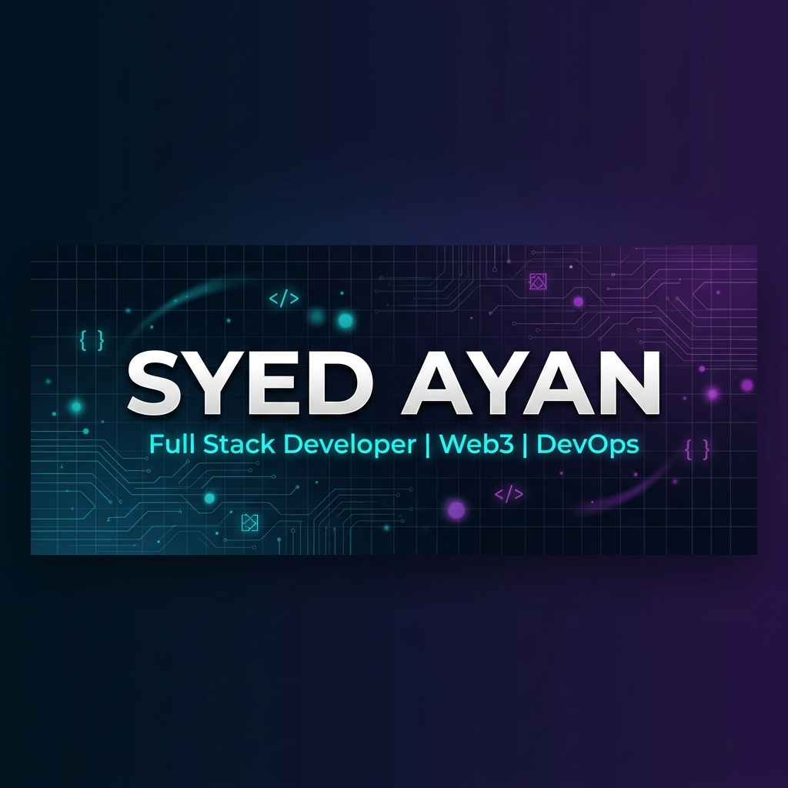

  

  # Hi, I'm Syed Ayan 👋
  **Full Stack Developer · Web3 Builder · DevOps Learner**

  
  
  

---

## 🚀 About Me
I build production-ready web and blockchain applications with a strong focus on scalability, clean architecture, and real-world usability.

- 🔭 Currently working on smart systems and decentralized products
- 🌱 Exploring advanced system design and cloud-native engineering
- 🧩 Interested in backend performance, Web3 UX, and developer tooling

## 🛠 Tech Stack
**Languages:** JavaScript, TypeScript, Solidity, Rust  
**Frontend:** React, Next.js, Tailwind CSS  
**Backend:** Node.js, Express, WebSockets, Zod  
**Data:** PostgreSQL, MongoDB, Prisma, Redis  
**Web3:** Ethereum, Solana, Hardhat, Web3.js  
**DevOps/Cloud:** Docker, Kubernetes, AWS, Nginx, GitHub Actions, Vercel

## 🌟 Featured Projects
- 🚗 [Smart Parking Management System](https://github.com/SyedAynan/Smart-Parking-Management-System)
- 🏦 [Nexus Bank](https://github.com/SyedAynan/Nexus-Bank)
- 🧠 [Neural Feedback](https://github.com/SyedAynan/Neural-Feedback)

## 📈 GitHub Activity

  <picture>
    <source media="(prefers-color-scheme: dark)" srcset="https://raw.githubusercontent.com/SyedAynan/SyedAynan/output/github-snake-dark.svg" />
    <source media="(prefers-color-scheme: light)" srcset="https://raw.githubusercontent.com/SyedAynan/SyedAynan/output/github-snake.svg" />
    
  </picture>

## 🤝 Connect
- GitHub: [@SyedAynan](https://github.com/SyedAynan)
- Vercel: [elight1](https://vercel.com/elight1)
